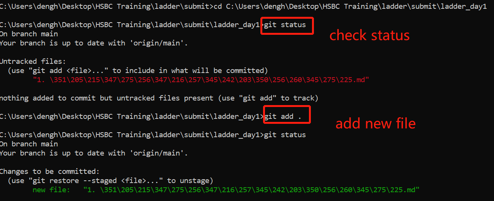

# 1. 配置环境记录 (for Windows)

## 1）JDK安装后路径添加方法

### CMD里面java -version出现以下结果安装成功

## 2）Eclipse安装

### 安装成功并可读取编辑READ.ME文件

## 3）Github Classroom

### classroom加入后可以看到已经布置的assignment如下

# 2. Github Repository创建并上传

## 1）add new repository

## 2) git clone to local git

## 3) add markdown file to local repository

## 4）git push changes to github

